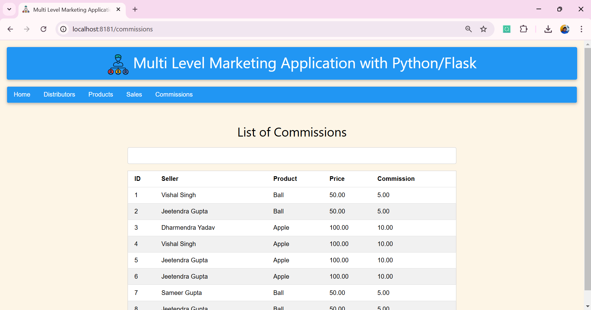

# Multi-Level Marketing Application with Python/Flask

A Python web application built using Flask that simulates a Multi-Level Marketing (MLM) system. The app allows you to manage distributors, products, sales, and commissions.

## Table of Contents

1. [Project Overview](#project-overview)
2. [Features](#features)
3. [Installation](#installation)
   - [Pre-requisites](#pre-requisites)
   - [Setup Instructions](#setup-instructions)
4. [Usage](#usage)
   - [Running the Application](#running-the-application)
   - [API Endpoints](#api-endpoints)
5. [Database Models](#database-models)
6. [Technologies Used](#technologies-used)
7. [Screenshots](#screenshots)
---

## Project Overview

This project is a **Multi-Level Marketing (MLM)** web application designed to simulate an MLM system using Python and Flask. The application allows users to:

- Manage distributors, products, and sales.
- Track commissions for each distributor based on sales.
- View the performance of each distributor in the network.

---

## Features

- **Distributor Management**: Add and view distributors.
- **Product Management**: Add and view products with their pricing.
- **Sales Tracking**: Record sales and calculate earnings based on product prices.
- **Commission Calculation**: Automatically calculate and assign commissions based on sales for each distributor in the MLM structure.
- **Responsive UI**: User-friendly interface using W3.CSS.

---

## Installation

### Pre-requisites

Before setting up the project, ensure that you have the following installed on your machine:

- Python 3.x
- pip (Python package installer)
- SQLite (or any other database of your choice)

### Setup Instructions

1. **Clone the Repository**:
   ```bash
   git clone https://github.com/jeetendra29gupta/multi-level-marketing.git
   cd multi-level-marketing
   ```

2. **Create a Virtual Environment**:
   It's recommended to use a virtual environment to manage dependencies:
   ```bash
   python3 -m venv .venv
   source .venv/bin/activate  # For Windows use .venv\Scripts\activate
   ```

3. **Install Dependencies**:
   Use `pip` to install the required dependencies:
   ```bash
   pip install -r requirements.txt
   ```
   
---

## Usage

### Running the Application

1. **Start the Flask Development Server**:
   Run the following command to start the server:
   ```bash
   python main_app.py
   ```

2. **Access the Application**:
   Once the server is running, open your browser and navigate to:
   ```
   http://localhost:8181
   ```

### API Endpoints

Here are the available routes in the application:

| Route                     | Method | Description                                      |
| ------------------------- | ------ | ------------------------------------------------ |
| `/`                       | GET    | Home page displaying an overview of the MLM app. |
| `/distributors`            | GET    | View all distributors.                          |
| `/add_distributor`         | GET, POST | Add a new distributor.                          |
| `/products`                | GET    | View all products.                              |
| `/add_product`             | GET, POST | Add a new product.                              |
| `/sales`                   | GET    | View all sales.                                 |
| `/add_sale`                | GET, POST | Add a new sale.                                 |
| `/commissions`             | GET    | View commissions for each distributor.          |

---

## Database Models

The application uses the following database models to structure data:

### 1. **Distributors**
- `id`: Primary key, unique identifier for each distributor.
- `distributor_name`: Name of the distributor.
- `added_by_id`: ID of the distributor who added this distributor (for MLM hierarchy).
- `created_at`: Timestamp when the distributor was created.
- `updated_at`: Timestamp for the last update.

### 2. **Products**
- `id`: Primary key, unique identifier for each product.
- `product_name`: Name of the product.
- `product_price`: Price of the product.
- `created_at`: Timestamp when the product was created.
- `updated_at`: Timestamp for the last update.

### 3. **Sales**
- `id`: Primary key, unique identifier for each sale.
- `distributor_id`: Foreign key referencing the distributor who made the sale.
- `product_id`: Foreign key referencing the product sold.
- `product_price`: Price of the product at the time of sale.
- `earned`: The amount the distributor earns from this sale.
- `created_at`: Timestamp when the sale was created.
- `updated_at`: Timestamp for the last update.

### 4. **Commissions**
- `id`: Primary key, unique identifier for each commission.
- `sale_id`: Foreign key referencing the sale associated with the commission.
- `distributor_id`: Foreign key referencing the distributor receiving the commission.
- `commission`: The calculated commission value.

---

## Technologies Used

- **Flask**: A lightweight Python web framework for building the web application.
- **SQLAlchemy**: Object-relational mapping (ORM) to interact with the database.
- **W3.CSS**: CSS framework for creating a responsive and clean user interface.
- **SQLite**: Lightweight relational database to store data locally.

---

## Screenshots
> Index Page
> 
 
> Distributors Page
> 
> 

> Products Page
> 
> 

> Sales Page
> 
> 

> Commissions Page
> 
---